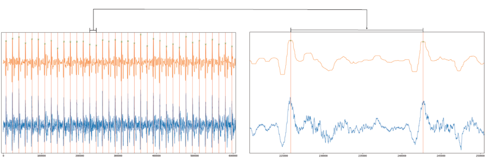

# Vascular Spectrogram Classification

本專案使用 PyTorch 與 ResNet50 模型，進行聲音訊號的時頻譜分類，用於分類血管聲音為正常或異常。

---
## 1. 專案簡介
### 研究背景

* 洗腎患者的血管若狹窄 (堵塞)，將無法進行洗腎，因此需藉由血管造影檢查血管是否狹窄，以進行血管疏通手術。

* 由於血管造影為侵入式檢查，又因為成本問題無法普及和隨時監控，因此有此發想：利用非侵入式可攜麥克風，蒐集洗腎患者的血管聲音以做分析, 達到及時地診斷血管是否狹窄。

### 方法突破
*  有別於過往血管音分析研究，首次以血管聲音的「時頻譜 (2D)」輸入 ResNet 分類模型，進行模型訓練，以分類血管狹窄與否。

* 以均值濾波搭配低通濾波，研究出能準確切割大量單一週期訊號的方法, 以獲得大量訓練樣本。(模型的 input data 為一個週期訊號的時頻譜，訊號的波峰與波峰之間唯一週期)。

## 2. 方法說明
### 蒐集聲音訊號
* 由醫師協助定位並標示要量測的血管位置，並標記此血管為狹窄 (stenosis) 或正常 (normal)。
* 收音裝置取樣頻率為22050 elements/sec. (即每秒紀錄22050 個樣本點)。

### 聲音訊號處理
以下步驟程式碼存放於：audio_processing/

* 低通濾波：設定截止頻率為 1000 Hz, 將原始訊號濾除頻率 1000 Hz 以上的訊號。 (參考 Pyaudio_create_lowpass_1k.py)

* 均值濾波：將訊號的每一點與其周圍的點做平均, 降低訊號雜訊，以利後續定位波峰切割訊號。 (參考 Pyaudio_create_medium_filter_1k.py)

* 切割訊號：根據均值濾波後的波型定位波峰 (下圖橘色波形)，並將位置對應到低通濾波後的訊號 (下圖藍色波形)，對其切割出每一周期。PS.將藍色的單一週期訊號，由短時傅立葉轉換為時頻譜，即為 ResNet 的訓練資料 (參考 pyaudio_peak_cut.py) 


### 訓練分類模型 
以下步驟皆參考：spectrogram_classification/pyaudio_training_resnet50.py

* 建立訓練集與測試集：兩集依病人為單位來分割 (同一病人的聲音訊號不會同時出現在 train set & test set)，正常樣本標記為 0, 狹窄樣本標記為 1。

* 產生時頻譜圖：利用短時傅立葉轉換，將每個單一週期訊號，由一維的時域訊號，轉換為二維的時頻域。

* 建立分類模型：載入 torchvision 內建的 ResNet50 模型架構, 其架構是從 VGGNet (一般CNN) 改良而來。

* 模型績效指標：使用準確度 (accuracy)、敏感度 (sensitivity)、特意度 (specificity)。


## 3. 專案結構

```
vascular_spectrogram_classification/
│
├── audio_processing/                           
│  ├── abnormal/                          # 存放洗腎患者阻塞血管的原始音檔 (WAV)
│  ├── normal/                            # 存放洗腎患者正常血管的原始音檔 (WAV)
│  ├── output/                            # 經由 python 訊號處理後的所有音檔 (WAV)
│  ├── Pyaudio_create_lowpass_1k.py       # 對正常與狹窄的音檔進行低通濾波處理
│  ├── Pyaudio_create_medium_filter_1k.py # 對正常與狹窄的音檔進行均值濾波處理
│  └── pyaudio_peak_cut.py                # 對濾波後的波型定位波峰，並切割出多個單一週期訊號
│
├── spectrogram_classification/                 
│  ├── abnormal_peak_cut_1k_selected/    # 存放血管阻塞的單一週期訊號 (WAV)
│  ├── normal_peak_cut_1k_selected/      # 存放血管正常的單一週期訊號 (WAV)
│  └── pyaudio_training_resnet50.py      # 利用 STFT 生成時頻譜，並使用 ResNet50 進行二分類訓練
│
├── README.md                            # 專案說明文件 
└── requirements.txt                     # 所需套件列表 (其中 PyTorch 相關套件為 CPU 版本)
```

---

## 4. 注意事項
### 關於套件版本
requirements.txt. 中的 PyTorch 相關套件為 CPU 版本
```bash
pip install -r requirements.txt
```

若使用 GPU，可選用安裝其他相容版本套件

官網選擇相容版本:  
[https://pytorch.org/get-started/locally](https://pytorch.org/get-started/locally)

例如 CUDA 11.8 環境：
```bash
pip install torch==2.2.2+cu118 torchaudio==2.2.2+cu118 torchvision==0.17.2+cu118 -f https://download.pytorch.org/whl/torch_stable.html
```

### 關於資料

因涉及病人隱私，僅提供少量匿名化的血管音訊樣本，作為模型測試與範例用途。

